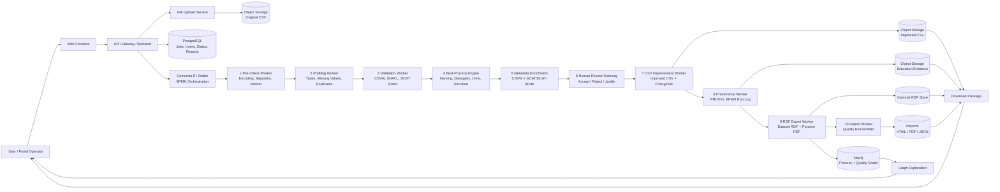
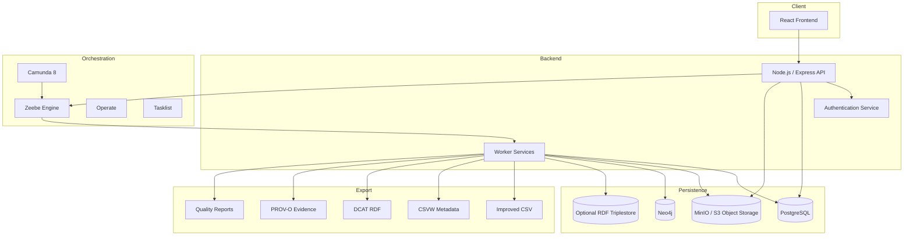

# SODPUB — Semantic Open Data Publishing and Improvement Framework

## Overview

SODPUB is a BPMN-orchestrated framework for improving the technical, semantic, and provenance quality of tabular Open Government Data datasets, particularly CSV files.

The system combines:

- BPMN-based workflow orchestration using Camunda 8 and Zeebe
- Automated CSV quality analysis and repair
- Metadata enrichment using W3C CSVW and DCAT standards
- Semantic validation using SHACL
- Provenance generation using PROV-O
- Human-in-the-loop review processes
- RDF export and graph persistence
- Reproducible evidence package generation

The goal of SODPUB is not only to improve datasets themselves, but also to improve the entire publishing process and make it transparent, reproducible, interoperable, and scientifically auditable.

---

# Motivation

Open Government Data portals often suffer from:

- inconsistent CSV structures
- missing metadata
- heterogeneous formats
- lack of provenance
- missing validation pipelines
- undocumented manual interventions
- low interoperability between portals

Most portals currently focus only on dataset publication, while the publication process itself remains undocumented and irreproducible.

SODPUB addresses this gap by introducing a workflow-driven publishing and improvement architecture that combines data quality engineering, semantic web standards, and executable BPMN processes.

---

# Scientific Contribution

SODPUB introduces the concept of:

> BPMN-orchestrated provenance-aware dataset improvement workflows for interoperable Open Data publishing.

The framework contributes:

1. Process-aware Open Data publishing
2. Reproducible dataset improvement workflows
3. Automated and human-guided quality enhancement
4. Machine-readable provenance evidence
5. RDF-based process documentation
6. Standards-based metadata generation
7. FAIR and interoperable export packages

---

# Core Architecture


# Workflow Description
1. CSV Upload
Users upload CSV files through the frontend or API.
The original dataset is stored unchanged for:
- reproducibility
- auditing
- before/after comparison
- provenance tracking

### 2. Pre-Check Worker
The first worker performs low-level technical validation:
- encoding detection
- separator detection
- malformed row detection
- header normalization
- BOM handling
- delimiter consistency
- empty column detection
This stage ensures technical processability before semantic analysis.

### 3. Profiling Worker
The profiling worker analyzes dataset characteristics:
- missing values
- duplicate rows
- datatype inference
- outlier detection
- value distribution
- pattern recognition
- cardinality analysis  
The generated profile becomes the basis for automated improvement suggestions.

### 4. Validation Worker
The validation layer checks compliance against:
- CSVW metadata rules
- SHACL constraints
- DCAT requirements
- custom organizational rules  
The validation output is machine-readable and reproducible.

### 5. Best-Practice Engine
This component applies improvement recommendations based on:
- W3C CSV on the Web recommendations
- Open Data publication guidelines
- semantic naming conventions
- datatype normalization
- metadata completeness checks
- interoperability heuristics
Examples:
- converting dates into ISO 8601
- normalizing boolean values
- harmonizing column naming
- suggesting URI-compatible identifiers

### 6. Metadata Enrichment
SODPUB automatically generates metadata artifacts:
#### CSVW Metadata
Provides structured table descriptions including:
- column definitions
- datatypes
- language information
- foreign keys
- schema definitions
#### DCAT Metadata
Creates interoperable dataset descriptions for catalog publication.
#### DCAT-AP.de
Adds German Open Data interoperability requirements compatible with GovData and public administration metadata standards.

### 7. Human Review Gateway
Not all improvements should be automated.
The human review stage allows operators to:
- inspect proposed changes
- approve or reject suggestions
- justify manual overrides
- add contextual metadata
This creates transparent human-in-the-loop governance.

### 8. CSV Improvement Worker
The approved modifications are applied to generate:
- improved CSV datasets
- normalized values
- corrected datatypes
- harmonized structures
Additionally, all modifications are documented in structured change logs.

### 9. Provenance Generation
The provenance layer exports:
- workflow execution history
- executed BPMN tasks
- responsible agents
- applied rules
- transformation activities
using W3C PROV-O.
This enables fully reproducible publishing workflows.
---

# Output Package

```text
sodpub-output/
├── original/
│   └── dataset.csv
├── improved/
│   └── dataset_improved.csv
├── metadata/
│   ├── csvw-metadata.json
│   ├── dcat.ttl
│   └── dcat-ap-de.ttl
├── provenance/
│   ├── prov-o.ttl
│   ├── bpmn-run-log.json
│   └── changeset.json
├── validation/
│   ├── quality-before.json
│   ├── quality-after.json
│   └── shacl-report.ttl
└── report/
    ├── report.html
    └── report.pdf
```

# Output Components
## original/
Contains the unchanged uploaded source dataset.
## improved/
Contains the improved dataset after workflow execution.
## metadata/
Contains semantic metadata representations:
CSVW metadata
DCAT RDF
DCAT-AP.de RDF
## provenance/
Contains workflow provenance and execution evidence.
## validation/
Contains machine-readable quality assessment outputs and semantic validation reports.
## report/
Contains human-readable reports for operators and auditors.

# Output components details:
```text
├── original/  
│   └── dataset.csv  
          📖 The unmodified original file uploaded by the user. It serves as a reference and enables reproducibility as well as before-and-after comparisons.  
├── improved/  
│   └── dataset_improved.csv  
          📖 The CSV file that has been automatically and/or manually improved after applying quality and best-practice rules. Changes may include, for example, data type corrections, header normalization, encoding fixes, or duplicate removal.  
├── metadata/  
│   ├── csvw-metadata.json  
          📖 Machine-readable CSVW metadata description of the table, conforming to the W3C CSV on the Web standard. Includes information on columns, data types, primary keys, formats, and semantic meanings.  
│   ├── dcat.ttl  
          📖 RDF/Turtle representation of the dataset in accordance with DCAT. Describes the dataset, distribution, license, keywords, publisher, and other open data metadata in an interoperable manner.  
│   └── dcat-ap-de.ttl  
          📖 Extended RDF metadata based on the German DCAT-AP.de profile. Includes national requirements such as GovData(german open data portal) compatibility and German administrative metadata.  
├── provenance/  
│   ├── prov-o.ttl  
          📖 RDF-based provenance description in accordance with PROV-O. Documents which activities, processes, rules, or individuals performed the data transformation.  
│   ├── bpmn-run-log.json  
          📖 Technical execution log of the BPMN process from Camunda/Zeebe. Contains information about completed tasks, timestamps, errors, statuses, and workflow steps.  
│   └── changeset.json  
          📖 A structured list of all changes made to the dataset. It documents, for example, the original values, the new values, the rule applied, the confidence score, and the worker responsible.  
├── validation/  
│   ├── quality-before.json  
          📖 Quality metrics of the original dataset prior to enhancement. These may include metrics such as completeness, consistency, schema errors, or metadata coverage.  
│   ├── quality-after.json  
          📖 Quality metrics following processing by SODPUB. Used to directly demonstrate quality improvements and the impact of the process.  
│   └── shacl-report.ttl  
          📖 RDF-based validation report according to SHACL. Documents semantic or structural violations of defined RDF or metadata rules.  
└── report/  
    ├── report.html  
          📖 Interactive, human-readable quality and process report in HTML format. Can visualize charts, quality metrics, changes, and workflow results.  
    └── report.pdf  
          📖 Static exported version of the quality report for archiving, academic documentation, or external distribution.  
```
---
# RDF Knowledge Graph Layer
SODPUB exports both:
1. Dataset semantics
2. Process semantics
as RDF.  
This allows:  
- semantic querying
- process mining
- workflow traceability
- quality graph analysis
- provenance reasoning

# Neo4j Integration
## Neo4j is used as an exploration and visualization layer for:
- workflow relationships
- quality issue graphs
- provenance chains
- dataset lineage
- transformation dependencies
### Neo4j is intentionally not treated as the canonical RDF storage layer.
### For full RDF/SPARQL interoperability, an optional triplestore may additionally be used


# Technologies

| Layer | Technology |
|---|---|
| Frontend | React + Vite |
| Backend API | Node.js + Express |
| Workflow Engine | Camunda 8 + Zeebe |
| Workers | Node.js Worker Services |
| Relational Storage | PostgreSQL |
| Object Storage | MinIO / S3 |
| Graph Database | Neo4j |
| RDF Validation | SHACL |
| Metadata Standards | CSVW, DCAT, DCAT-AP.de |
| Provenance | PROV-O |
| Semantic Serialization | RDF/Turtle, JSON-LD |

---
# Standards
- W3C DCAT 3
-  DCAT-AP
- DCAT-AP.de
- W3C CSV on the Web
- W3C PROV-O
- SHACL
- RDF 1.1 - 1.2
- FAIR principles

# Example BPMN Workflow (need BPMN modeler engine)


# Docker Infrastructure


# Intended Use Cases
- Open Government Data portals
- municipal publishing workflows
- research data publishing
- FAIR data infrastructures
- semantic data quality pipelines
- reproducible public sector data engineering

# Research Positioning
- Open Data publishing systems
- workflow management systems
- semantic interoperability frameworks
- provenance-aware data engineering
- reproducible research infrastructures

The framework focuses on improving not only datasets themselves, but also the transparency and reproducibility of the publication lifecycle.

# Vision

SODPUB aims to transform Open Data publication from a mostly manual and opaque activity into a reproducible, semantically interoperable, provenance-aware engineering process.

# Repository Structure
```text
sodpub/
├── frontend/
├── backend/
├── workers/
├── bpm/
├── rdf/
├── validation/
├── docker/
├── docs/
├── examples/
├── datasets/
└── reports/
```

# Citation
```
@software{sodpub,  
  title={SODPUB: Semantic Open Data Publishing Framework},  
  author={Florian Hahn},  
  year={2026},  
  url={https://github.com/SODIC-research/SODPUB}  
}  
```
# License
Released under the MIT License. See `LICENSE` for details.
CC-BY 4.0 for documentation and examples

## 👩‍🔬 Maintainer

**Florian Hahn**

SODIC Research Group, TU Chemnitz

[Website](https://www.tu-chemnitz.de/informatik/dm/team/fh.php.en) — Contact: `florian.hahn@informatik.tu-chemnitz.de`

# Currently in Development:
- Open Data portal connector ecosystem
- CKAN plugin integration
- automatic ontology alignment
- Reproducable Scoring
- Docker deployment

  
# Future Research Directions
- LLM-assisted metadata recommendation
- multilingual metadata enrichment
- process mining integration
- FAIR maturity scoring
- synthetic data quality comparison
- SPARQL federation support
